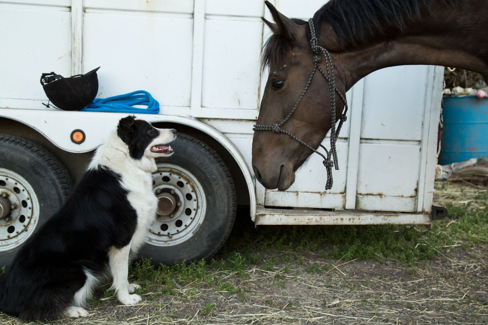

## 🐴 Mustang Makeover Project

## 📍 The Issue

As of 2025, over **64,000 American Mustangs** remain in government holding pens. Managed by the BLM (Bureau of Land Management), these wild horses are protected but costly—estimated at **$15,000 per animal** over a lifetime. In 2024 alone, total federal holding costs were over **$1 billion**.

Many of these horses stay in pens for years. Being wild and untouched, they are often passed over for adoption due to the steep training curve and lack of visibility.

---

## 🏇 The Competition

To address this, the BLM launched a creative solution:  
**100 trainers, 100 horses, 100 days**.  
Trainers are randomly assigned a wild mustang and given 100 days to gentle and train the horse, culminating in a public showcase to demonstrate the animal’s potential.

This challenge accomplishes multiple goals:
- Transforms overlooked mustangs into adoptable companions
- Educates the public on the versatility and potential of these horses
- Raises awareness about herd management and adoption programs

🎥 *Recommended documentary:* [**Wild Horse, Wild Ride**](https://www.youtube.com/watch?v=RX28swUzD-U)

---

## 💫 My Experience

In 2016, I competed in a spin-off of this event hosted by **Oregon Mustangs**.  
The rules were the same: 98 days to train a wild horse assigned at random.

### 🐎 Meet Lark
- **Herd:** Murderer's Creek HMA  
- **Background:** This herd is thought to descend from cavalry stock and is known for a lighter build.
- **Questioning My Decision:** It took 8 days before I could even touch her.
- **Turning Point:** By Day 36, we were cantering under saddle. Everything accelerated from there.

### 🌱 Where She Is Now
Lark was adopted by a woman who rides her in **endurance competitions**. One of the proudest moments for me was seeing the adopter’s **5-year-old daughter lead Lark** out to her a pasture. Lark followed calmly and politely as the little girl ran around her and jumped through the grass. 
> I couldn't have been more proud of how trustworthy, solid, and kind my project horse turned out. 

---

## 🙏 Thank You

Special thanks to **Michael and Leona Jimenez of MLJ Ranch** for:
- Providing the training space
- Encouraging me every step of the way
- Making participating in this experience possible

---

## 🔗 Learn More
- [BLM Herd Management Areas (HMAs)](https://www.blm.gov/programs/wild-horse-and-burro/herd-management/herd-management-areas)

---

### Why It Matters

This wasn’t just about horses—it was about perserverance, consistency, trust, and transformation.  
Skills I carry forward into everything I do.

  

